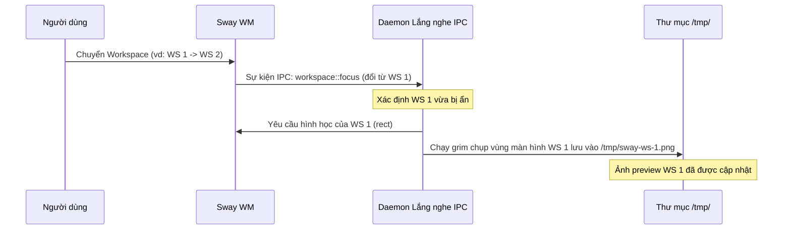
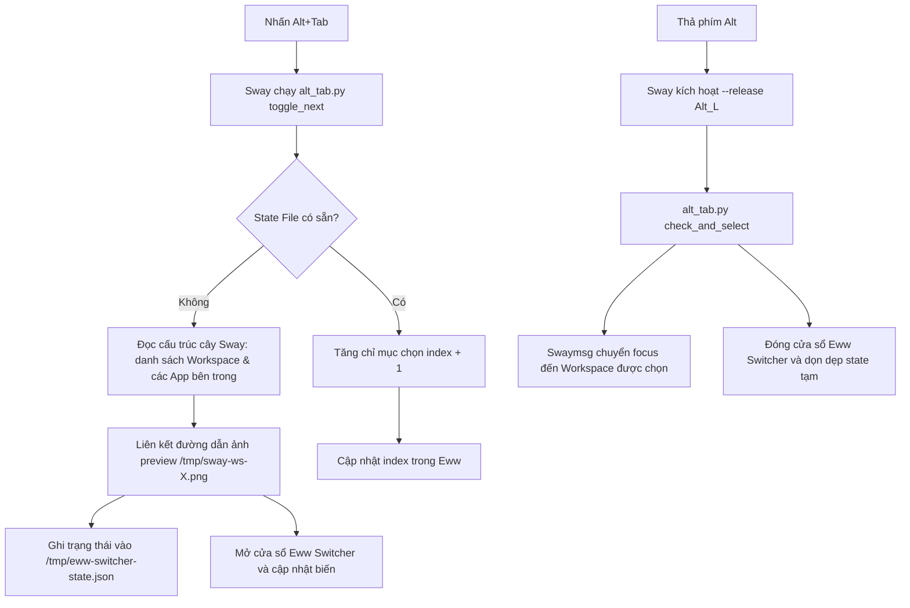

# Thiết kế Alt+Tab Workspace Switcher & Cải tiến Tabbed Layout cho Sway

Tài liệu thiết kế chi tiết cải tiến trải nghiệm đa nhiệm (UX) trên Sway WM thông qua việc chuyển đổi Alt+Tab sang mô hình quản lý Workspace có ảnh thu nhỏ (preview) và tối ưu giao diện tab (`Mod+w`).

## 1. Yêu cầu & Phân tích UX

### Alt+Tab Switcher hiện tại (Vấn đề):
* **Chỉ hiển thị icon:** Chưa hiển thị ảnh thu nhỏ (preview) của ứng dụng hoặc màn hình.
* **Độ trễ phản hồi (Latency):** Việc fork chạy Python script mới mỗi lần nhấn phím `Alt+Tab` làm giảm độ mượt mà. Lệnh `grim` chụp ảnh bất đồng bộ ngay lúc nhấn gây ra hiện tượng giật/trễ hình ảnh (pop-in delay).
* **Mô hình chuyển app đơn lẻ:** Với giao diện tiling WM, việc chuyển đổi giữa các không gian làm việc (workspace) trực quan hơn việc chuyển giữa hàng chục cửa sổ riêng lẻ.

### Thiết kế mới (Giải pháp):
* **Workspace Switcher:** Thay vì hiển thị từng ứng dụng đơn lẻ, giao diện Alt+Tab sẽ hiển thị danh sách các Workspace. Mỗi Workspace đại diện bởi một thẻ card gồm:
  * Ảnh chụp màn hình preview thực tế của workspace đó.
  * Hàng icon ứng dụng nhỏ bên dưới ảnh preview đại diện cho các ứng dụng đang chạy bên trong workspace.
* **Chụp ảnh ngầm (Daemon):** Một tiến trình nền sẽ chụp ảnh màn hình workspace hiện tại ngay trước khi chuyển sang workspace khác. Nhờ đó, file ảnh preview luôn sẵn sàng trong `/tmp/` và hiển thị tức thì.
* **Cải tiến `Mod+w` (Tabbed Layout):** Tăng kích thước tab, thêm padding rộng rãi, font chữ hiện đại và màu sắc Catppuccin Mocha rõ rệt để có giao diện đẹp như trình duyệt web.

---

## 2. Luồng Hoạt động (Data Flow & Architecture)

### A. Cơ chế Cache Ảnh chụp ngầm (Workspace Screenshot Daemon)


### B. Luồng Hiển thị Alt+Tab Switcher


---

## 3. Thiết kế Giao diện (Eww Widget & CSS)

### Eww Yuck (`eww.yuck`):
* Cấu trúc biến `switcher_workspaces` lưu trữ danh sách workspace:
  ```json
  [
    {
      "name": "1",
      "id": 1234,
      "thumbnail": "/tmp/sway-ws-1.png",
      "apps": ["/usr/share/icons/.../firefox.svg", "/usr/share/icons/.../foot.svg"]
    }
  ]
  ```
* Widget `switcher-card` hiển thị danh sách các card workspace nằm ngang. Mỗi card khi hoạt động (`active`) sẽ có viền sáng bóng.
* Bên trong card:
  1. Box hiển thị ảnh preview (tải từ `/tmp/sway-ws-X.png` nếu tồn tại, nếu không hiển thị một hình nền gradient mặc định).
  2. Hàng ngang các icon nhỏ kích thước 20x20px hiển thị ứng dụng đang chạy.

### Eww CSS (`eww.css`):
* Thiết kế bo góc lớn (`border-radius: 16px`), đổ bóng sâu (`box-shadow`), và nền mờ kính (`background: rgba(30, 30, 46, 0.85); backdrop-filter: blur(10px)`).
* Card hoạt động (`switcher-item.active`) có viền phát sáng màu Catppuccin Blue (`border-color: #89b4fa`).

---

## 4. Cấu hình Tabbed Layout (`Mod+w`) trong Sway

Sử dụng cấu hình trang trí cửa sổ trong `~/.config/sway/config` để biến đổi các tab:
```sway
# Định dạng font chữ hiển thị trên thanh tab
font pango:Inter Semi-Bold 10

# Cấu hình padding và độ dày viền của thanh tiêu đề tab
titlebar_border_thickness 1
titlebar_padding 10 6

# Màu sắc trang trí theo theme Catppuccin Mocha
# Cấu trúc: class border backgr text indicator child_border
client.focused          #89b4fa #89b4fa #1e1e2e #f38ba8 #89b4fa
client.unfocused        #181825 #181825 #a6adc8 #181825 #181825
client.focused_inactive #313244 #313244 #cdd6f4 #313244 #313244
client.urgent           #f38ba8 #f38ba8 #1e1e2e #f38ba8 #f38ba8
```

---

## 5. Kế hoạch Triển khai (Phân rã Công việc)

1. **Bước 1 (Sway Tabbed Layout):** Cập nhật cấu hình `.config/sway/config` với cấu hình font, padding, border và màu sắc cho titlebar. Thực hiện `swaymsg reload` để xác thực.
2. **Bước 2 (Daemon Chụp ảnh):** Phát triển file python daemon `sway_workspace_daemon.py` tự động chạy khi khởi động Sway để lắng nghe sự kiện IPC và thực hiện chụp ảnh lưu cache `/tmp/sway-ws-X.png`.
3. **Bước 3 (Cập nhật Logic Alt+Tab):** Viết lại `alt_tab.py` để nhóm cửa sổ theo Workspace, liên kết ảnh chụp màn hình tương ứng và cập nhật dữ liệu cấu trúc mới sang Eww.
4. **Bước 4 (Cập nhật Widget Eww):** Sửa đổi `eww.yuck` và `eww.css` để hiển thị đúng thiết kế Workspace Switcher dạng lưới thẻ ngang và hàng icon nhỏ.
5. **Bước 5 (Đăng ký Autostart & Thử nghiệm):** Cấu hình tự động chạy Daemon trong file Sway config. Kiểm tra toàn bộ luồng hoạt động thực tế.
